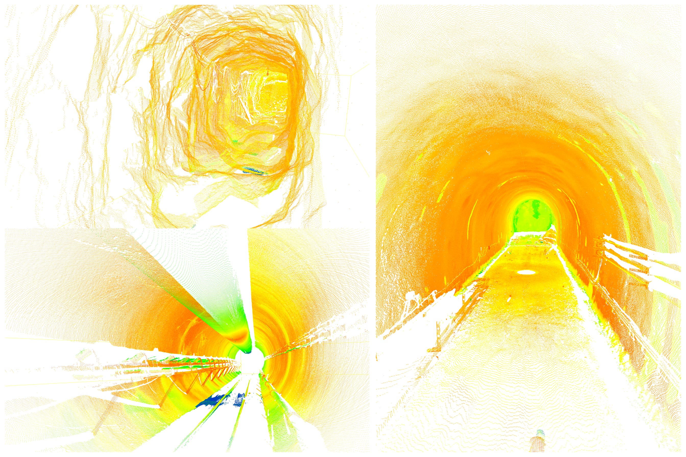

<h1 align="center">TunnelReg-Benchmark</h1>

<p align="center">
  <b>A Benchmark for Point Cloud Registration in Tunnel Scenes</b>
</p>

<p align="center">
  <a href="LICENSE"></a>
  
  
  
  
  
</p>

<p align="center">
  
</p>

TunnelReg-Benchmark is an open benchmark for evaluating point cloud
registration algorithms in **tunnel scenes**. Tunnels are challenging
environments for 3D registration: scans are long and narrow with strong
self-similarity along the tunnel axis, surfaces are weakly textured, and
overlap between adjacent stations can vary widely. These characteristics
make many off-the-shelf registration pipelines (originally designed for
indoor rooms or driving scenes) struggle when applied to tunnel data.

This repository provides a unified evaluation pipeline for classical
baselines (FPFH + RANSAC, CSHOT + RANSAC, ICP) implemented in C++ on top
of PCL, and two machine learning-based methods,
[GeoTransformer](https://github.com/qinzheng93/GeoTransformer) and
[SpinNet](https://github.com/QingyongHu/SpinNet), wired up to the **same
metrics** so that all methods are directly comparable on the same data.

## 📦 Repository Structure

```
TunnelReg-Benchmark/
├── assets/teaser.jpg
├── EvalData/                       # Place the dataset here
├── src/
│   ├── eval.cpp                    # C++ evaluator: FPFH / CSHOT / ICP
│   ├── CMakeLists.txt
│   ├── register_spinnet.py         # SpinNet evaluator
│   ├── register_geotransformer.py  # GeoTransformer evaluator
│   └── requirements.txt
├── third_party/
│   ├── GeoTransformer/             # git submodule
│   └── SpinNet/                    # git submodule
├── LICENSE
└── README.md
```

## 🚀 Installation

### 1. Clone the repository (with submodules)

```bash
git clone --recurse-submodules https://github.com/<your-org>/TunnelReg-Benchmark.git
cd TunnelReg-Benchmark
```

If you already cloned without `--recurse-submodules`:

```bash
git submodule update --init --recursive
```

### 2. Build the C++ baselines

Requires [PCL](https://pointclouds.org/) 1.10+ and a C++14 compiler.

```bash
cd src
cmake -B build -S . -DCMAKE_BUILD_TYPE=Release
cmake --build build -j
```

### 3. Set up the Python environment

```bash
conda create -n tunnelreg python=3.8 -y
conda activate tunnelreg

# Install PyTorch that matches your CUDA version (see https://pytorch.org)
pip install torch==1.13.1+cu117 torchvision==0.14.1+cu117 \
    --extra-index-url https://download.pytorch.org/whl/cu117

# Install the rest
pip install -r src/requirements.txt

# Install GeoTransformer as an editable package
cd third_party/GeoTransformer
pip install -e .
cd ../..
```

Then place the pre-trained weights into each submodule as instructed by
its own README:

- GeoTransformer: `third_party/GeoTransformer/weights/*.pth.tar`
- SpinNet: `third_party/SpinNet/pre-trained_models/*.pkl`

## 📂 Dataset

The TunnelReg dataset can be downloaded from Baidu Netdisk:

- **Link**: <https://pan.baidu.com/s/1fEGAhgOTSODj-H8JIpWXCg>
- **Extraction code**: `It will be provided after the manuscript is accepted.`

Unpack everything into `EvalData/`:

```
EvalData/
├── config.txt
├── Scan_001.pcd
├── Scan_002.pcd
└── ...
```

`config.txt` lists registration pairs one block at a time:

```
<source_id>-<target_id>
r00 r01 r02 tx
r10 r11 r12 ty
r20 r21 r22 tz
0   0   0   1
<blank line separator>
```

Numeric IDs are zero-padded to three digits to match the
`Scan_<id>.pcd` filenames.

## 🔬 Evaluation

All commands are run from the repository root.

### Classical baselines (FPFH / CSHOT / ICP)

```bash
./src/build/eval EvalData/eval_config.txt
```

A minimal `eval_config.txt`:

```ini
data_directory      = EvalData
pairs_config_file   = config.txt

voxel_grid_leaf_size            = 0.1
inlier_distance_threshold       = 0.05
fmr_inlier_ratio_threshold      = 0.05
rr_rte_threshold                = 0.10
rr_rre_threshold                = 5.0
ransac_max_iterations           = 5000
icp_max_iterations              = 50
```

### SpinNet

```bash
python src/register_spinnet.py \
    --data_dir   ./EvalData \
    --config     ./EvalData/config.txt \
    --output     ./EvalData/spinnet_results.txt \
    --model      KITTI \
    --voxel_size 0.2
```

Use `--model 3DMatch` for the indoor variant. Pass `--spinnet_root /path`
to override the default `third_party/SpinNet/` location.

### GeoTransformer

```bash
python src/register_geotransformer.py \
    --data_dir   ./EvalData \
    --config     ./EvalData/config.txt \
    --output     ./EvalData/geotransformer_results.txt \
    --model      KITTI \
    --voxel_size 0.2
```

Each script prints a summary table on stdout and writes the estimated
transforms (`*_results.txt`) plus per-pair detailed metrics
(`*_results_detailed.csv`).

## Acknowledgements

- [GeoTransformer](https://github.com/qinzheng93/GeoTransformer)
- [SpinNet](https://github.com/QingyongHu/SpinNet)

## 📖 Citation

<!-- TODO -->

## 📜 License

This project is released under the [MIT License](LICENSE).

## ✉️ Contact

**Prof. Shibin Tang** &nbsp;·&nbsp; Dalian University of Technology
&nbsp;·&nbsp; <tang_Shibin@dlut.edu.cn>
